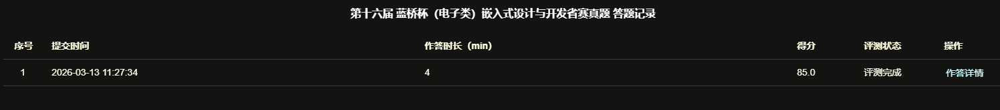
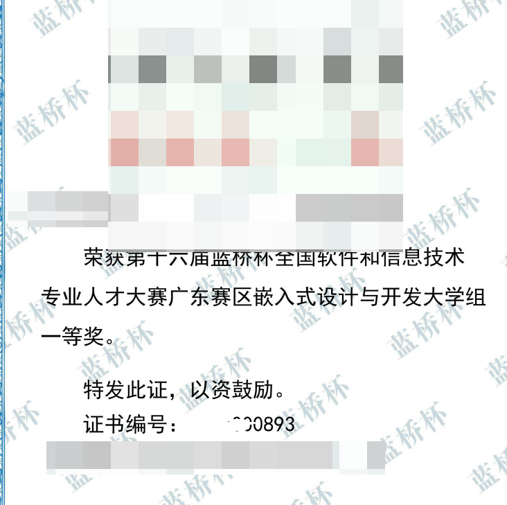

# 25年蓝桥杯省赛嵌入式省一代码

本仓库为 2025 年蓝桥杯省赛嵌入式方向项目代码留档，包含工程文件、核心源码以及比赛相关展示材料。

## 项目说明

- 工程类型：STM32 嵌入式工程
- 开发环境：MDK-ARM / CubeMX
- 主要目录：
  - `Core`：核心应用代码
  - `Drivers`：底层驱动
  - `MDK-ARM`：Keil 工程文件
  - `CODE`：项目相关补充代码

## 成绩说明

该项目在 4T 评测平台主观题部分获得满分。

### 4T 评测平台截图

## 获奖情况

获得蓝桥杯省赛一等奖，奖状如下：

